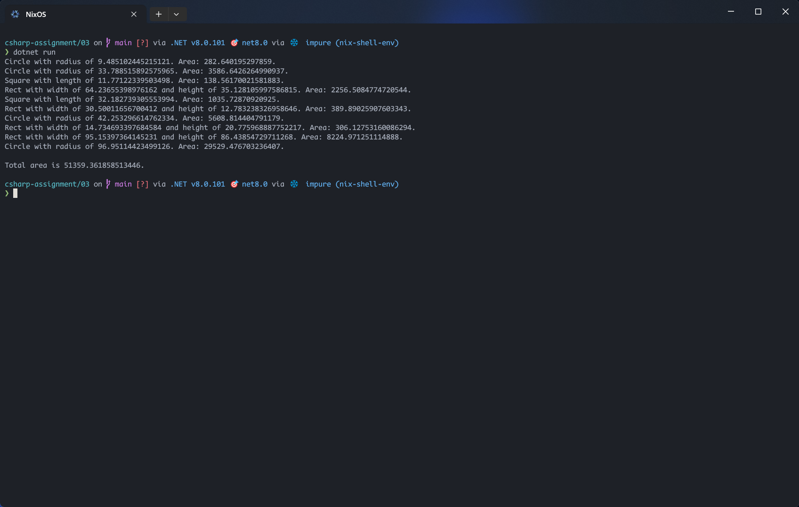

# Assignment 03

## Description

1. Create classes for square, circle and rectangle. Organize the hierarchy.
2. Calculate the area.
3. Create ten shapes randomly and calculate the total area of them.

## Screenshots

