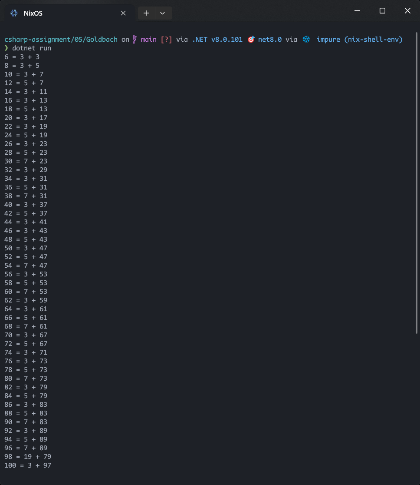
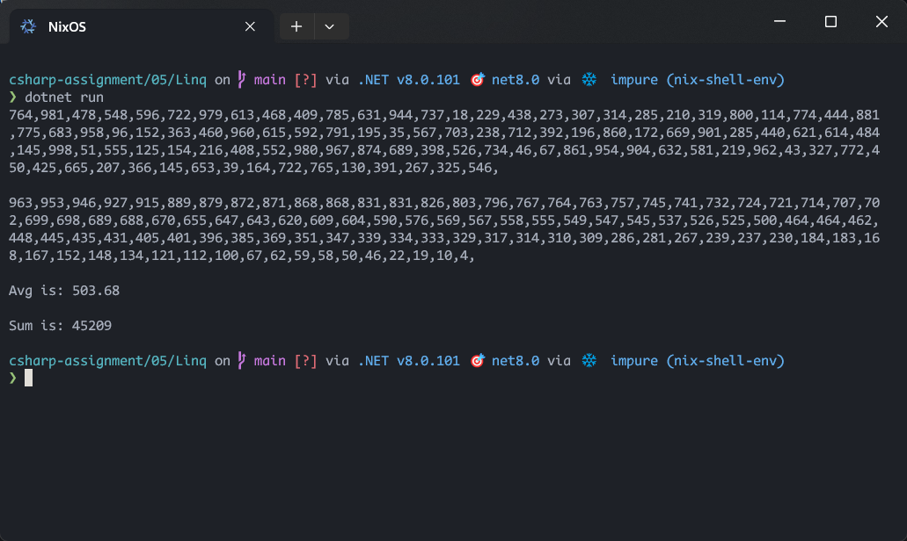

# Assignment 05

## Description

1. Dessolve the even number into the sum of two prime numbers. Print the solution.
2. Use Linq to sort the numbers and print average and sum of the sequence.

## Screenshots

