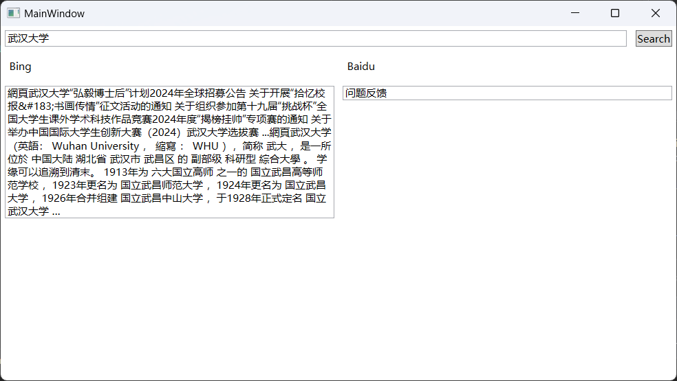
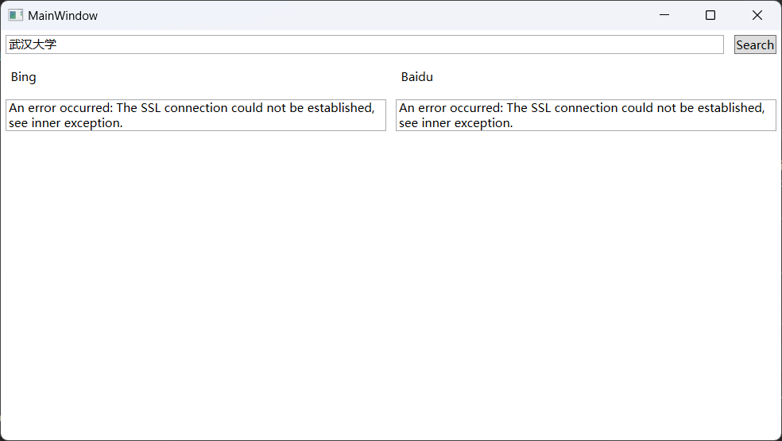

# Assignment 10

## Introduction

Write a search engine client using Bing and/or Baidu to search.

## Attention

1. Selector is unfeasible to determine due to the complex and inconsistent structure of modern search engine page.
2. Baidu has anti-spider mechanism.
3. Register for API can cost money and is hence not adopted. Spider is in place of that.

## Screenshots

